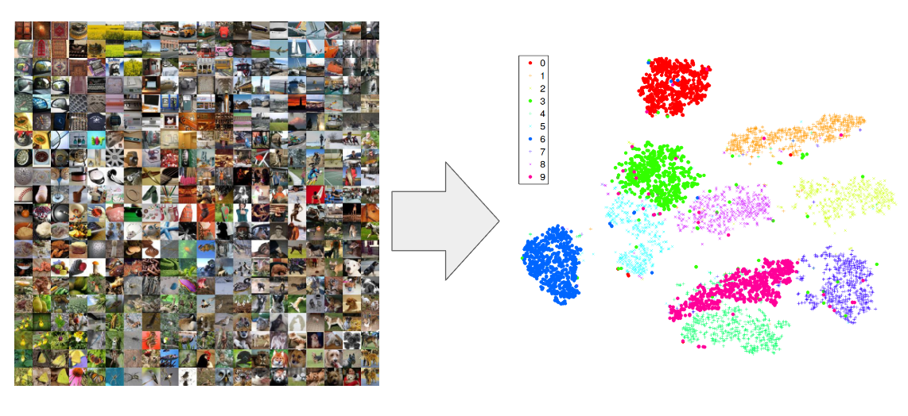
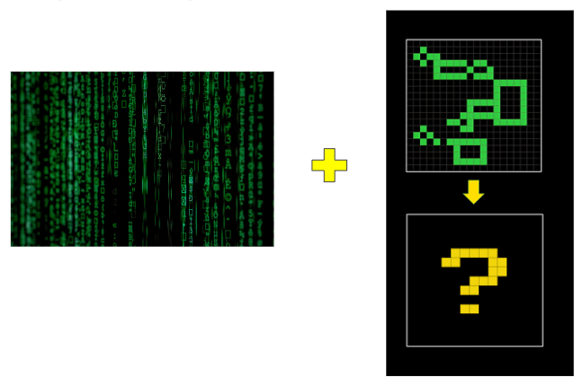

# Solution Summary
<!--
https://www.kaggle.com/WinningModelDocumentationGuidelines
https://www.kaggle.com/solution-write-up-documentation
https://www.kaggle.com/competitions/arc-prize-2024#paper-award
--->

## Abstract

TODO:

## Motivation

In the [ARC challenge](https://arcprize.org/arc) we have to learn a transformation rule given a few
high-dimensional pairs of input and output images. The images can have a size of up to 30x30 pixels
and each pixel can take 10 different colors. The images are not as complex as real world images, but nevertheless
they are high dimensional data.

### How can we learn from few high-dimensional examples?

To solve each ARC problem we have to find the **right representation** of the data. When humans solve the
tasks, the challenge is to find the **right perspective** to look at the problem. Once we have the right
perspective of the data the ARC problems are trivial to solve.

The right representation of the data allows to decrease the dimensionality of the data and makes
possible to learn the transformation from very few examples.

<!--
TODO: think of a better image
I don't like this image, don't know if helps.

--->

### How can we learn a good representation of the ARC problems?

If we train a model to do tasks that require a good representation of the data, it's likely that the
model will internally develop the required representation.

My insight is that we can use the ARC problems in many different ways to learn that representation,
not just in the original proposed task that asks to generate the output for an image given a few input-output pairs.

### Omni-ARC: Training a single model to do multiple ARC-related tasks

| **examples + input -> output** | **examples -> code** | **code + input -> output** |
|--------------------------------|----------------------|----------------------------|
|                                |                      |                            |
| **inputs -> input**            | **code -> inputs**   | **inputs -> code**         |
|                                |                      |                            |

- `examples + input -> output`. The original task of the ARC dataset.
- `inputs -> input`. Generating new inputs requires to understand the distribution of the grids. It could also be done with the outputs, that should also follow some distribution.
- `examples -> code`. This is the approach used by Ryan Greenblat with GPT-4o
- `code + input -> output`. This is equivalent to the first task, but instead of giving examples as input, it gives the code definition of the problem.
- `code -> inputs`. Each input to a task follows some distribution, given a description of the
  distribution the model should be able to generate samples of that distribution.
- `inputs -> code`. We could also do the opposite task, given some inputs write code to generate that distribution.
- `examples + input + output -> is the output correct?`. It is possible to train the model to verify wether a proposed output is correct.
- `examples + input + output options-> select the correct output`. We can train a model to select the correct output between multiple options.

All the listed tasks require that the model learns some useful representation of the ARC image. The idea
behind the Omni-ARC approach is to train a single model to do all the tasks, with the hope that a shared
representation across all the tasks will generalize better than training the model to do a single task.

_Omni-ARC, a single model that does all the ARC-related tasks (and it has a very cool logo)_

## Solution

The solution on a nutshell:

1. Take an LLM and fine-tune it on different ARC-related tasks
2. Do test-time fine-tuning with the private test data
3. Inference
4. Ensemble with 2020 solution

### Training

#### Model

For the last trainings I have used `Qwen2.5` LLM and I have trained three different model sizes: 0.5B, 1.5B and 7B. During the challenge I did most of the experiments with the 0.5B model. Choosing the right model size is important
because the submission time is limited and the VRAM of the submission machines is just 2x16GB. If we
want to do test-time fine-tuning we have to use a small model that can be fine-tuned with enough
speed on Kaggle's machines.

I used LoRA to fine-tune the models because fine-tuning the whole model did not show significant improvements.
Moreover at test time it was beneficial to use the pre-trained LoRA adapter.

#### Data

I used the following datasets for training:

- The original [ARC dataset](https://www.kaggle.com/competitions/arc-prize-2024/data)
- Michael Hodel's [RE-ARC dataset](https://github.com/michaelhodel/re-arc)
- Recently released [BARC dataset](https://huggingface.co/collections/barc0/synthetic-arc-dataset-6725aa6031376d3bacc34f76)
- Simon Strandgaard's [PQA dataset](https://github.com/neoneye/arc-dataset-collection/tree/main/dataset/PQA)
- Simon Strandgaard's [Tama dataset](https://github.com/neoneye/arc-dataset-tama)
- [Mini-ARC](https://github.com/ksb21ST/Mini-ARC)
- [nosound's 9 hand crafted ARC tasks](https://www.kaggle.com/datasets/zaharch/arc-nosound-tasks)
- [Andy Penrose's 5 tasks](https://www.kaggle.com/datasets/andypenrose/extra-arc-tasks-for-testing)

#### Data augmentation

The following augmentations were applied randomly to all the input and outputs of the problem:

- Rotations
- Flips
- Color changes
- Swap between train and test examples

#### Problem augmentation

In addition to the data augmentation I also did problem augmentation by applying a transformation
only to the inputs or to the outputs. This transformation created new ARC problems by composing the
original ARC transformation with randomly new ones.

These new transformations needed to be reversible, otherwise the new generated problems could not
be solvable. I used the following additional transformations:

- Rotations and/or flips
- Padding the image
- Upscale
- Mirror

TODO: image showing an augmented problem

#### Training tasks

On the final trainings I used four of the Omni-arc tasks:

- `examples + input -> output`. The original task of the ARC dataset.
- `inputs -> input`. Generating new inputs requires to understand the distribution of the grids. It could also be done with the outputs, that should also follow some distribution.
- `examples + input + output -> is the output correct?`. It is possible to train the model to verify wether a proposed output is correct.
- `examples + input + output options-> select the correct output`. We can train a model to select the correct output between multiple options.

I did not use any of the code tasks because I wasn't able to get good results when predicting code.
I believe that with more time that approach could work, as shown in [Getting 50% (SoTA) on ARC-AGI with GPT-4o](https://redwoodresearch.substack.com/p/getting-50-sota-on-arc-agi-with-gpt) or [Combining Induction and Transduction for Abstract Reasoning](https://openreview.net/forum?id=UmdotAAVDe).

#### Training hyperparameters

For an example of the parametrization of the last training you can go [here](./modeling/Iteration_50_last_trainings.md#steps-to-train-the-model).
The most relevant parameters were:

- LoRA rank: 128 for the 0.5B and 1.5B models, 64 for the 7B model
- Learning rate: 5e-5, with a linear schedule and a warmup ratio of 2e-2
- Batch size: 16 (with 1 batch size per device and 2 accumulation steps)
- Training steps: 2e5 for the 0.5B and 1.5B models, 1e5 for the 7B model
- Max sequence length: 8196
- Trained on 8xA100 GPUs

Bigger models showed higher efficiency when learning, they reached a lower training loss for the same
number of training steps.

TODO: plot showing efficiency

I used huggingface's trl and accelerate libraries for the training.

### Test-time fine-tuning

Fine-tuning a model on ARC tasks is not enough to do well on the private test set. By applying test-time fine-tuning we could improve the number of solved problems from 11 to 33 for one of the models that I trained along the challenge.

This is my interpretation of the test-time fine-tuning:

- For each test problem that had `n` train samples, I fine-tuned the model using `n-1` train samples and
  using the remaining sample as a test sample. The selection of the test sample was done randomly on the fly during training.
- I used [data augmentation](#data-augmentation) just like in the previous training
- I fine-tuned a model for each of the test problems, so 100 fine-tuned models were generated on each submission.
- I used batch size 1 in the test-time fine-tuning to be able to learn the new problems as fast as possible.
- The model was fine-tuned for ~300 steps on each problem
- A slightly lower learning rate was used for test-time fine-tuning (TODO:)

### Inference

Data augmentation was applied also at inference, and the data augmentation was reverted from the prediction to get the original output. 96 predictions were done for each problem and voting was used to select the most
promising predictions.

VLLM was used to generate the predictions. Each fine-tuned model was used to generate predictions for its problem.

### Ensemble

I ensembled my model predictions with the [2020 solution](https://www.kaggle.com/code/mehrankazeminia/3-arc24-developed-2020-winning-solutions). Since the 2020 solution only requires CPU, I managed to run
it on the background while I used the GPU for fine-tuning and inference with my model. I only had to
be careful with the RAM usage because both jobs had to share the same memory.

## Learnings

### Prompting is not enough, test-time inference is needed

## Things that didn't worked

### Predicting code to solve ARC tasks

## Future steps

- Buy an [Omni-man funko pop figure](https://amzn.eu/d/efqVvEh) to celebrate the prize.

## Links

- Repo
- Notebooks

## Acknowledgments

- [Veridas](https://veridas.com/en/) for providing me access to its compute cluster during all the challenge. Most of the experiments were done on Veridas cluster, using A6000 GPUs with 48GB of VRAM.
- [Strong Compute](https://strongcompute.com/) for providing compute for training the last models for
  the challenge. They gave me access to A100 GPUs with 80GB of VRAM, which allowed me to train bigger models.
- [Qwen](https://huggingface.co/Qwen) for training and releasing a family of very capable LLMs with
  many different sizes.
- [Weigths and bias](https://wandb.ai/home) I used it to track all the experiments in a single place.
  It's an amazing tool and free for individuals.
- [Lambdalabs](https://lambdalabs.com/). I did some short (but expensive) experiments on the last
  week of the challenge in Lambdalabs. They provide me with some free credits that partially covered
  this experiments.
- ARC team. It's been a pleasure to work in this super interesting challenge for a few months. Thanks
  for creating the challenge and specially to Chollet for all his wisdom and teachings.
- Family. I couldn't have done all this work without the help of my wife and the appreciation from
  my children. My family followed my progress during the challenge and cheered me up when I advanced in the leaderboard.
