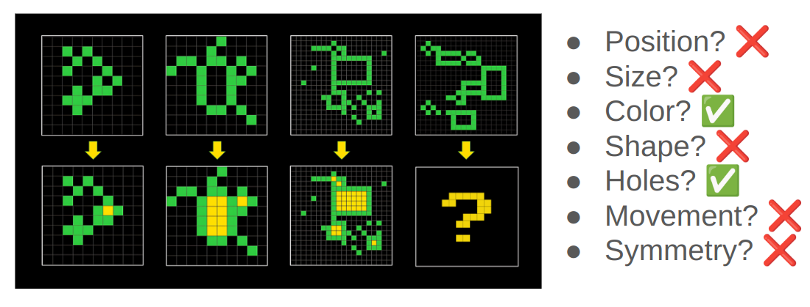

# Solution Summary
<!--
https://www.kaggle.com/WinningModelDocumentationGuidelines
https://www.kaggle.com/solution-write-up-documentation
https://www.kaggle.com/competitions/arc-prize-2024#paper-award
--->

## Abstract

TODO:

## Motivation

In the [ARC challenge](https://arcprize.org/arc) we have to learn a transformation rule given a few
high-dimensional pairs of input and output images. The images can have a size of up to 30x30 pixels
and each pixel can take 10 different colors. The images are not as complex as real world images, but nevertheless
they are high dimensional data.

### How can we learn from few high-dimensional examples?

To solve each ARC problem we have to find the **right representation** of the data. When humans solve the
tasks, the challenge is to find the **right perspective** to look at the problem. Once we have the right
perspective of the data the ARC problems are trivial to solve.

The right representation of the data allows to decrease the dimensionality of the data and makes
possible to learn the transformation from very few examples.

<!--
TODO: think of a better image
I don't like this image, don't know if helps.

--->

### How can we learn a good representation of the ARC problems?

If we train a model to do tasks that require a good representation of the data, it's likely that the
model will internally develop the required representation.

My insight is that we can use the ARC problems in many different ways to learn that representation,
not just in the original proposed task that asks to generate the output for an image given a few input-output pairs.

### Omni-ARC: Training a single model to do multiple ARC-related tasks

| **examples + input -> output** | **examples -> code** | **code + input -> output** |
|--------------------------------|----------------------|----------------------------|
|                                |                      |                            |
| **inputs -> input**            | **code -> inputs**   | **inputs -> code**         |
|                                |                      |                            |

- `examples + input -> output`. The original task of the ARC dataset.
- `inputs -> input`. Generating new inputs requires to understand the distribution of the grids. It could also be done with the outputs, that should also follow some distribution.
- `examples -> code`. This is the approach used by Ryan Greenblat with GPT-4o
- `code + input -> output`. This is equivalent to the first task, but instead of giving examples as input, it gives the code definition of the problem.
- `code -> inputs`. Each input to a task follows some distribution, given a description of the
  distribution the model should be able to generate samples of that distribution.
- `inputs -> code`. We could also do the opposite task, given some inputs write code to generate that distribution.
- `examples + input + output -> is the output correct?`. It is possible to train the model to verify wether a proposed output is correct.
- `examples + input + output options-> select the correct output`. We can train a model to select the correct output between multiple options.

All the listed tasks require that the model learns some useful representation of the ARC image. The idea
behind the Omni-ARC approach is to train a single model to do all the tasks, with the hope that a shared
representation across all the tasks will generalize better than training the model to do a single task.

_Omni-ARC, a single model that does all the ARC-related tasks (and it has a very cool logo)_

## Solution

## Learnings

## Things that didn't worked

## Future steps

- Buy an [Omni-man funko pop figure](https://amzn.eu/d/efqVvEh) to celebrate the prize.

## Acknowledgments

- Veridas
- Strong Compute
- Qwen
- Weigths and bias
- Lambdalabs
- Family
