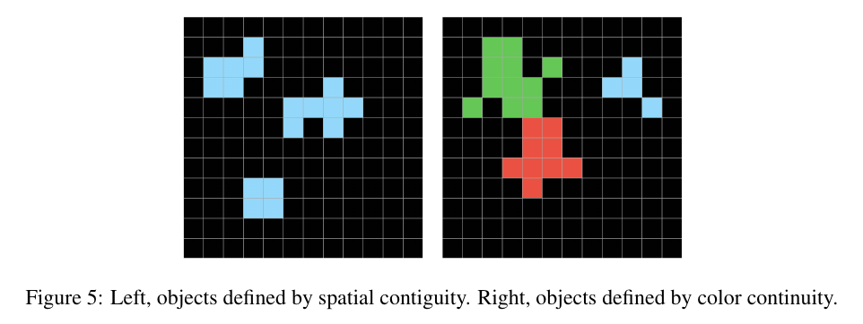

# Iteration 2. Representation of Grids

_22-07-2024_

## Goal

Can we teach a model to learn a representation of the grids?

## Motivation

A good representation is crucial for abstraction. We need to teach the model
the priors needed to solve the ARC challenge.

This could be a paper titled: `Learning priors via Visual Question Answering to solve the ARC challenge.`
To solve the challenge the model needs to build a representation with the core knowledge priors.
This iteration will show if an LLM is able to learn a representation of a single grid. If it works
I could move on to learn other concepts that need two grids.

Recent winners from [AIMO challenge](https://www.kaggle.com/competitions/ai-mathematical-olympiad-prize/discussion/519303) have created a huge dataset to solve the challenge. Data is really
important. If I'm able to create a good grid synthesizer that would be an advantage.

## Development

### Priors to learn

#### Core Knowledge priors from Chollet's paper

Which are the priors we can learn from a single grid? I have copied the priors from Chollet's paper
excluding the priors that need two grids to be learned.

> **Object cohesion**: Ability to parse grids into “objects” based on continuity criteria including color continuity or spatial contiguity (figure 5), ability to parse grids into zones, partitions.

I believe there is some ambiguity regarding the diagonals, f.e. the blue object in the right image is a single object or 2 objects?

I have been visualizing many train examples and could not find an example where the diagonal continuity was
harmful. What I have find is that we might have to look at the images from the color and spatial perspectives, because they both are useful.

> **Numbers and Counting priors** : Many ARC tasks involve counting or sorting objects (e.g. sorting by size), comparing numbers (e.g. which shape or symbol appears the most (e.g. figure 10)? The least? The same number of times? Which is the largest object? The smallest? Which objects are the same size?). All quantities featured in ARC are smaller than approximately 10.

<!--- --->

> **Basic Geometry and Topology priors**: ARC tasks feature a range of elementary geometry and topology concepts, in particular:
>
> - Lines, rectangular shapes (regular shapes are more likely to appear than complex shapes).
> - Symmetries
> - Containing / being contained / being inside or outside of a perimeter.

#### Summary of priors to learn

- Parse grids into objects based on continuity criteria (color continuity or spatial contiguity)
- Parse grids into zones or partitions
- Count
- Sort objects by size
- Comparing numbers (e.g. which shape or symbol appears the most (e.g. figure 10)? The least? The same number of times? Which is the largest object?)
- Recognize lines, rectangular shapes
- Symmetries
- Containing / being contained / being inside or outside of a perimeter.

#### Questions to ask the model

- General description, name all the objects, color, size, type of the object (square, rectangular, line...)
- Color of the background
- Number of objects
- Area/count for some color
- Is there some simmetry?
- Questions about different grids, do not just give one grid as input but give many and ask about certain grid. This will ensure that it is able to create individual representations for the grids.

The grid creator should return some metadata that will be used later to create the questions and answers.

## Results

## Conclusion

## Next steps

- Once the grid representation is learned, we need to teach the model to learn transformation between grids. Some priors are change-related and cannot be learned from a single grid

## TODO

- [ ] How to evaluate the representation of the models? Phi-3, Llama3, Gemma2
- [ ] Start with basic square world
- [ ] Curriculum learning might be helpful to do cause attribution
