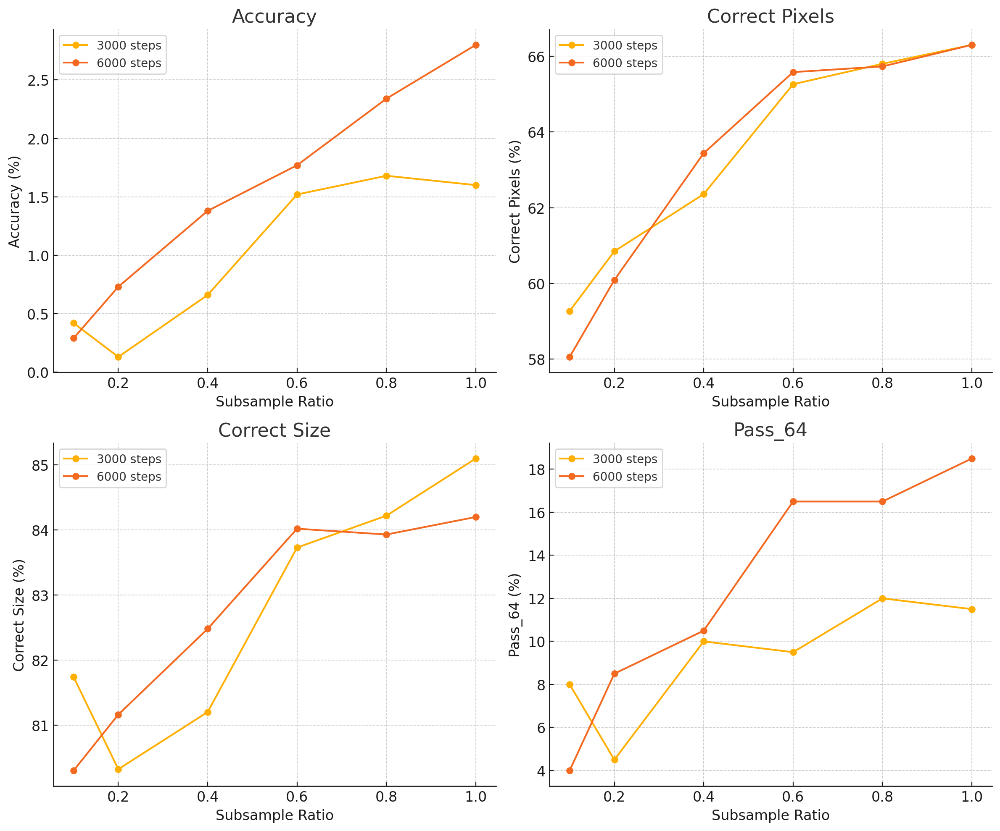
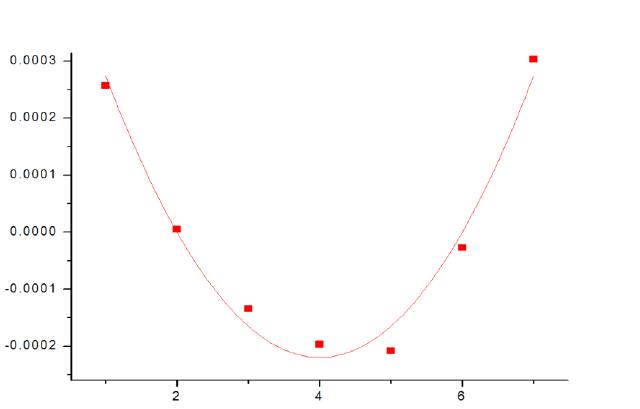

# Iteration 16. Plan next steps

_02-09-2024_

## Goal

Analyze current progress and plan the next steps.

## Current progress

So far I have been replicating the MindsAI approach. Probably the main difference is that I fine-tune
an LLM and I believe they train a model from zero. They have been working in the problem for 2 years,
so they have more knowledge and likely more data to train on.

In summary the approach is:

1. Fine-tune an LLM on ARC tasks. I use data augmentation to generate more training tasks.
2. Test-time fine-tuning on the private test set
3. AIRV (Augment, Inference, Reverse augmentation and Vote)

Ensembling this approach with the 2020 baseline I have been able to reach a score of 28 on LB, position 11 at the time of doing the submission.
Only 15 people had beaten the baseline during the 3 months of competition.

I believe there is room for improvement with the current approach. F.e. I already know that using more
training data will likely result in a more accurate model.

## Rethinking the challenge

### Representation is the key to abstraction

How can we learn from few high-dimensionality data?

I believe that the only way to do that is having the right representation of the data, that lies on
a smaller dimension manifold that allows to learn from few data.

Thus the key is to learn a good representation of the ARC task space. There might be an additional difficulty
to find the right representation, f.e. humans typically have to search the right perspective of the data
to be able to solve a problem. But I will make the hypothesis that finding the right perspective is a
simpler problem, or that we could sample the model to find that perspective.

_If the data has 1 dimension, it is possible to learn (fit a curve) on it_

### How can we learn a good representation of the ARC problems?

If we teach the models to do tasks that require a good representation/understanding of the ARC problems
it is likely that the models will develop the right representations.

Which tasks can be useful to learn good representations?

- `examples + input -> output`. This is the current task that the model is learning
- `inputs -> input`. Generating new inputs requires to understand the distribution of the grids. It could also be done with the outputs, that should also follow some distribution.
- `examples -> code`. This is the approach used by Ryan Greenblat with GPT-4o
- `code + input -> output`. This is equivalent to the first task, but instead of giving examples as input, it gives the code definition of the problem.
- `code -> inputs`. Each input to a task follows some distribution, given a description of the
  distribution the model should be able to generate samples of that distribution.
- `inputs -> code`. We could also do the opposite task, given some inputs write code to generate that distribution.

I have the intuition that if a model learns to do all the tasks in the list will generalize better
than a model that only knows how to do one of the tasks. The representation of the ARC grids and problems
could be shared among all the tasks.

| **examples + input -> output** | **examples -> code** | **code + input -> output** |
|--------------------------------|----------------------|----------------------------|
|                                |                      |                            |
| **inputs -> input**            | **code -> inputs**   | **inputs -> code**         |
|                                |                      |                            |

Disentangling the inputs and the outputs is a good way to learn the correct representation, otherwise
it's possible to simple memorize the task. This could be done by reusing the same input distribution
for different tasks.

The code might be just pseudo-code, f.e. functions with good names and interface that are not implemented.
There are some problems that require perception to detect the objects. In those cases I can teach the
model to use some non implemented function, and on inference if I detect that the model tries to use
that function, use the model instead to generate the output instead of relying on code.

Having a model that can generate new inputs given a distribution or given code could be very useful
to expand the size of the training data.

### How can we represent a task

- Examples. This is the format of the ARC challenge.
- Code. We can use python code to implement the task. Code is an unambiguous way to represent the task.
- Natural language. We can also use natural language to represent the task, but natural language is ambiguous
  and I don't feel is a good approach.

**Abstraction**: going from examples to code  
**Synthesis**: going from code to examples

If I write python code to synthesize new examples, I could reuse that code to teach a model to go from examples to code.

## Next steps

### More data augmentation

I have realized that I can apply even more data augmentation to the training tasks. Currently I'm applying
geometric augmentations and color swapping both to the inputs and to the outputs.

But I have realized that I can use reversible augmentations (those that preserve the original information) to
create new tasks. They will be different tasks but totally valid.

This work because we can create new tasks by concatenating different transformations. If we create code
to synthesize new tasks, one way to generate a great number of tasks quickly is to compose different
transformations to create new tasks. So given an existing ARC task we can create a new one by applying
a new transformation.

We could apply reversible augmentations on the inputs or in the outputs. F.e. we could apply:

- Padding, f.e. adding a black or grey border
- Reflections
- Upscaling
- Geometric transformations

This approach will make the training tasks more difficult. It is likely that using this augmentations
will improve the current approach. I could start by simply doing an additional geometric transformation
on the tasks randomly.

### Multi-task approach

I would like to test the hypothesis that learning multiple tasks results in a better model. The easiest
way to test that is to train a model to both do the ARC challenges and to generate new inputs. This
experiment doesn't need new data, so we could test the hypothesis quickly.

### Examples to code approach

The next step would be to write python code to solve the training tasks. It should be written carefully
to have the smallest domain language possible.

The great advantage of using code is that we can verify the solutions. That is a huge advantage over
the current approach that generates solutions that can't be verified.

Ryan generates around 8k solutions. My guess is that I could generate 1k solutions in the most optimistic setup.
Thus fine-tuning is critical to have a higher quality model that doesn't need so many predictions.
He uses a 30k token prompt, fine-tuning will remove that necessity.
Revision is very important, having access to the output of the program and updating the solution.
He used GPT4-o, I don't have access to such a powerful model, but I have the power of fine-tuning an small model.

### Omni-ARC model

The final step would be to train a model to do all the tasks. That would require writing also
code to generate the input distributions to the tasks. I believe this approach has a great chance
of winning the ARC challenge.

## TODO

- [x] Add images to make the understanding of the ideas easier
