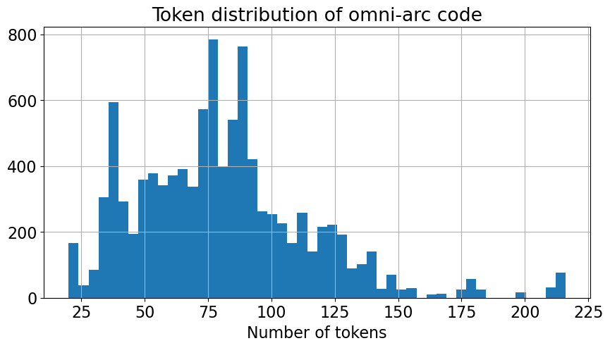

# Iteration 36. Solving evaluation tasks with code

_09-10-2024_

## Goal

Can we solve the evaluation tasks by predicting code that implements the tasks?

## Motivation

On [Iteration 34](Iteration_34_developing_omni_arc.md) I trained models on omni-arc tasks. It was unclear
if the approach of `output-from-examples` benefited from training the model to do multiple tasks.

However if I can predict python code that could be game-changer because I can verify the python
code with the train samples.

## Development

First models were trained with 100 training tasks, second model with close to 150. Coverage of the
training dataset is important because it's likely correlated with coverage of the evaluation and test dataset.

### First steps with inference

<details>
  <summary>Click to see bash commands</summary>

```bash
# baseline
python inference.py \
--model_path  /mnt/hdd0/Kaggle/arc24/models/20241006_omniarc_validation/02_omni-arc-400-code-from-examples-Qwen2.5-0.5B-Instruct_lr5e-5_14000steps_2gpus_8192msl/checkpoint-14000 \
--prompt_version code-from-examples-v0 \
--dataset_path /mnt/hdd0/Kaggle/arc24/data/arc-agi_evaluation_challenges.json \
--predictions_per_task 8 \
--output_filepath /mnt/hdd0/Kaggle/arc24/debug/first_predictions/checkpoint-14000/inference_evaluation_x008.json \
--verbose

python inference.py \
--model_path  /mnt/hdd0/Kaggle/arc24/models/20241006_omniarc_validation/02_omni-arc-400-code-from-examples-Qwen2.5-0.5B-Instruct_lr5e-5_14000steps_2gpus_8192msl/checkpoint-14000 \
--prompt_version code-from-examples-v0 \
--dataset_path /mnt/hdd0/Kaggle/arc24/data/arc-agi_evaluation_challenges.json \
--predictions_per_task 32 \
--output_filepath /mnt/hdd0/Kaggle/arc24/debug/first_predictions/checkpoint-14000/inference_evaluation_x032.json

python merge_lora.py --base_model_path /home/gbarbadillo/data/Qwen2.5-0.5B-Instruct --lora_path /mnt/hdd0/MEGA/projects/temp/20241006_omniarc_validation/05_omni-arc-400-code-from-examples-v1-Qwen2.5-0.5B-Instruct_lora128_lr1e-4_bs32_7000steps_2gpus_8192msl/checkpoint-7000 --output_path /home/gbarbadillo/data/Qwen2.5-0.5B-Instruct-omni-arc

python inference.py \
--model_path  /home/gbarbadillo/data/Qwen2.5-0.5B-Instruct-omni-arc \
--prompt_version code-from-examples-v1 \
--dataset_path /mnt/hdd0/Kaggle/arc24/data/arc-agi_evaluation_challenges.json \
--predictions_per_task 8 \
--output_filepath /mnt/hdd0/Kaggle/arc24/debug/second_model/checkpoint-7000/inference_evaluation_x008.json \
--verbose

python inference.py \
--model_path  /home/gbarbadillo/data/Qwen2.5-0.5B-Instruct-omni-arc \
--prompt_version code-from-examples-v1 \
--dataset_path /mnt/hdd0/Kaggle/arc24/data/arc-agi_evaluation_challenges.json \
--predictions_per_task 32 \
--output_filepath /mnt/hdd0/Kaggle/arc24/debug/second_model/checkpoint-7000/inference_evaluation_x032.json

python inference.py \
--model_path  /home/gbarbadillo/data/Qwen2.5-0.5B-Instruct-omni-arc \
--prompt_version code-from-examples-v1 \
--dataset_path /mnt/hdd0/Kaggle/arc24/data/arc-agi_evaluation_challenges.json \
--predictions_per_task 32 \
--temperature 0.5 \
--output_filepath /mnt/hdd0/Kaggle/arc24/debug/second_model/checkpoint-7000/inference_evaluation_x032_t5e-1.json

python inference.py \
--model_path  /home/gbarbadillo/data/Qwen2.5-0.5B-Instruct-omni-arc \
--prompt_version code-from-examples-v1 \
--dataset_path /mnt/hdd0/Kaggle/arc24/data/arc-agi_evaluation_challenges.json \
--predictions_per_task 32 \
--temperature 0.7 \
--output_filepath /mnt/hdd0/Kaggle/arc24/debug/second_model/checkpoint-7000/inference_evaluation_x032_t7e-1.json

python inference.py \
--model_path  /home/gbarbadillo/data/Qwen2.5-0.5B-Instruct-omni-arc \
--prompt_version code-from-examples-v1 \
--dataset_path /mnt/hdd0/Kaggle/arc24/data/arc-agi_evaluation_challenges.json \
--predictions_per_task 32 \
--temperature 0.9 \
--output_filepath /mnt/hdd0/Kaggle/arc24/debug/second_model/checkpoint-7000/inference_evaluation_x032_t9e-1.json

python inference.py \
--model_path  /home/gbarbadillo/data/Qwen2.5-0.5B-Instruct-omni-arc \
--prompt_version code-from-examples-v1 \
--dataset_path /mnt/hdd0/Kaggle/arc24/data/arc-agi_evaluation_challenges.json \
--predictions_per_task 32 \
--temperature 1 \
--output_filepath /mnt/hdd0/Kaggle/arc24/debug/second_model/checkpoint-7000/inference_evaluation_x032_t1.json

python inference.py \
--model_path  /home/gbarbadillo/data/Qwen2.5-0.5B-Instruct-omni-arc \
--prompt_version code-from-examples-v1 \
--dataset_path /mnt/hdd0/Kaggle/arc24/data/arc-agi_evaluation_challenges.json \
--predictions_per_task 128 \
--temperature 0.7 \
--output_filepath /mnt/hdd0/Kaggle/arc24/debug/second_model/checkpoint-7000/inference_evaluation_x128_t7e-1.json


python inference.py \
--model_path  /mnt/hdd0/MEGA/projects/temp/20241006_omniarc_validation/03_omni-arc-800-all-code-Qwen2.5-0.5B-Instruct_lr5e-5_26000steps_2gpus_8192msl/checkpoint-26000 \
--prompt_version code-from-examples-v0 \
--dataset_path /mnt/hdd0/Kaggle/arc24/data/arc-agi_evaluation_challenges.json \
--predictions_per_task 8 \
--temperature 0.7 \
--output_filepath /mnt/hdd0/Kaggle/arc24/debug/third_model/checkpoint-26000/inference_evaluation_x008_t7e-1.json

```

</details>

The model is generating valid python code, I have to improve the inference script to check that the
code is correct and create the output. Add timeouts for safety.

## Results

### Preliminary results

I solve 4% of the tasks from the evaluation dataset. All predictions seem to be correct because they
are validated against the train dataset. When using temperature 0 there does not seem to be any favorable scaling law.

Made up to 132 predictions, but the accuracy improves very slowly. The output from examples approach
had a very different dynamic.

### Token distribution of omni-arc code



We can see that the code is much smaller than predicting the whole grid which can have up to 1000 tokens,
but the code is 200 tokens at maximum, 5 times smaller.

## Conclusion

## Next steps

## TODO

- [x] How to execute the code safely and with timeouts? Check AIMO competition. This should be added
  to the omni-arc repo, because all the dsl functions are there.
- [ ] How does the method scale with compute? Validation should allow to scale well.
- [x] What is the token distribution of the functions that implement the training tasks?
- [x] Fix problems with evaluation metrics
- [x] Fix problem with inference returning an error code
